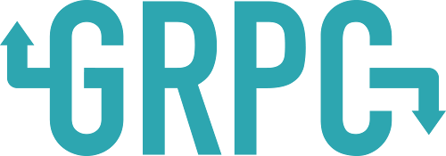

# gRPC Meetup Kit
Resource for creating your own gRPC event

## What is gRPC?
gRPC is a modern, open source remote procedure call (RPC) framework that can run anywhere. It enables client and server applications to communicate transparently, and makes it easier to build connected systems.

## Content for Your Event

### gRPC 101 Presentation

| Resource  | Duration | Description |
| --- | --- | --- |
| [Talk](https://www.youtube.com/watch?v=UVsIfSfS6I4) | 15m | Course intro video. |
| [Slides](https://docs.google.com/presentation/d/1dgI09a-_4dwBMLyqfwchvS6iXtbcISQPLAXL6gSYOcc/edit?usp=sharing) | n/a | Slides that go along with the talk. |
| [Codelab](https://codelabs.developers.google.com/codelabs/cloud-grpc/index.html) | 45m | Codelab that attendees can complete in [Cloud Shell](https://cloud.google.com/shell/) | 

## Resources and community

| Resource | Links |
| --- | --- |
| gRPC Website | <ul><li>[grpc.io](http://www.grpc.io/)</li></ul>|
| Codelab | <ul><li> [Building a gRPC service with Node.js](https://codelabs.developers.google.com/codelabs/cloud-grpc/index.html)</li><li>[Building a gRPC service with C#](https://codelabs.developers.google.com/codelabs/cloud-grpc-csharp/index.html)</li></ul> |
| Learn More | <ul><li>[GitHub Source](https://github.com/grpc)</li><li>[Extended gRPC Ecosystem](https://github.com/grpc-ecosystem)</li><li>[Blog](http://www.grpc.io/blog/)</li><li>[Youtube Channel](https://www.youtube.com/channel/UCrnk1HWelWnYtF78YZX80fg)</li></ul> |
| Ask Questions | <ul><li>[Gitter Chat](https://gitter.im/grpc/grpc)</li><li>[Google Group](https://groups.google.com/forum/#!forum/grpc-io)</li><li>[Stack Overflow](http://stackoverflow.com/tags/grpc/)</li></ul> |
| Keep in Touch | <ul><li>[Twitter](https://twitter.com/grpcio)</li></ul>|

## Request Support for Your Event

- [gRPC Stickers](https://goo.gl/forms/C3TCtFdobz4ippty2)
- [Sign up for office hours with gRPC team](https://goo.gl/forms/pvxNwWExr5ApbNst2)

## Provide Feedback

How can we improve? Please let us know what’s helpful and what we can do better by providing feedback through the dedicated surveys. Here's how:

### For Google Developer Groups

Register your event on developers.google.com/events using the correct event tags (gContent, Cloud)

You will receive an automated email with  personalized links to the surveys.

### For GDEs and All Other Content Bundle Users

Take the final survey after the workshop to [evaluate](https://docs.google.com/forms/d/e/1FAIpQLSdU8U-XKeyHp90FYS7KjA8OxuMAM_G95IvnY18gRM3j6smk_Q/viewform) the content.

Please share this link with your participants, if any, as well.

Your feedback is valuable to us; it helps us allocate more resources, budget, and plan better for future events. We'd love it if you could encourage all of your attendees to participate.
